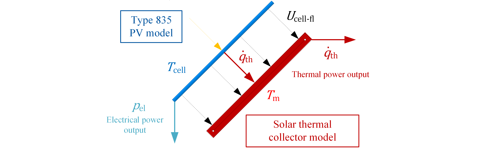
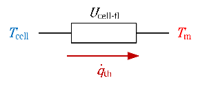

# TRNSYS_Type835_PVT
TRNSYS `Type835` is a PV model for the coupling with solar thermal absorber and collector models as PVT model developed for use in TRNSYS 17.

## License
See the [LICENSE](LICENSE) file for license rights and limitations (MIT).

## Basic idea
The main idea behind this model is to develop a PV performance model in TRNSYS, which can be coupled to existing models of solar thermal collectors or absorbers for the calculation of the electrical power output of WISC and covered PVT collectors. It is especially developed for the connection with thermal models which are based on the quasi-dynamic model of ISO 9806:2013  or ISO 9806:2017, e.g. TRNSYS Type 832. 

 
 
