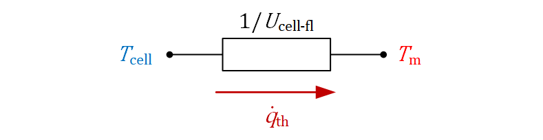

# TRNSYS_Type835_PVT
`Type835` is a PV model for the coupling with solar thermal absorber and collector models as PVT model developed for use in TRNSYS 17.

## License
See the [LICENSE](LICENSE) file for license rights and limitations (MIT).

## Basic idea
The main idea behind this model is to develop a PV performance model in TRNSYS, which can be coupled to existing models of solar thermal collectors or absorbers for the calculation of the electrical power output of WISC and covered PVT collectors (see Fig. 1). It is especially developed for the connection with thermal models which are based on the quasi-dynamic model of ISO 9806:2013 (ISO 9806, 2013) or ISO 9806:2017 (ISO 9806, 2017), e.g. TRNSYS Type 832 (Haller et al., 2013). As the electrical mode of operation has a significant impact on the thermal efficiency, the thermal performance coefficients for the thermal power output calculation of the PVT collector should be determined in MPP mode (Lämmle et al., 2017).  

 
Fig. 1. Coupled PVT model. 

As addition, the model includes a PV mode to simulate PV modules based on the same performance model, e.g. for a comparison of the electrical yield of a PV module and PVT collectors using identical PV cells. The major difference between the calculation of PV modules and PVT collectors in this approach results from the cell temperatures, which are determined by the fluid temperature in PVT collectors and by a steady-state module temperature in PV modules.

 
Fig. 2. Thermal network. 

In case of PVT collectors, the PVT cell temperature `T_cell` is calculated via an equivalent thermal network with an internal heat transfer coefficient `U_(cell-fl)`, which connects the PVT cell temperature with the mean fluid temperature `T_m` of the PVT collector (see Fig. 2), according to the electrical performance model of Lämmle et al. (2017). In case of PV modules, the PV cell temperature is calculated by the Faiman model (Faiman, 2008) or from NOCT conditions.  For further details see Documentation.

## References
Faiman, D., 2008. Assessing the outdoor operating temperature of photovoltaic modules. Progress in Photovoltaics: Research and Applications 16, 307–315.

Haller, M., Perers, B., Bales, C., Paavilainen, J., Dalibard, A., Fischer, S., Bertram, E., 2013. TRNSYS Type 832 v5.01, Dynamic Collector Model by Bengt Perers. Updated Input-Output Reference. 

ISO 9806, 2013. ISO 9806:2013 Solar energy - Solar thermal collectors – Test methods.

ISO 9806, 2017. ISO 9806:2017 Solar energy - Solar thermal collectors – Test methods. Second edition.

Lämmle, M., Oliva, A., Hermann, M., Kramer, K., Kramer, W., 2017. PVT collector technologies in solar thermal systems: A systematic assessment of electrical and thermal yields with the novel characteristic temperature approach. Solar Energy 155, 867-879.
